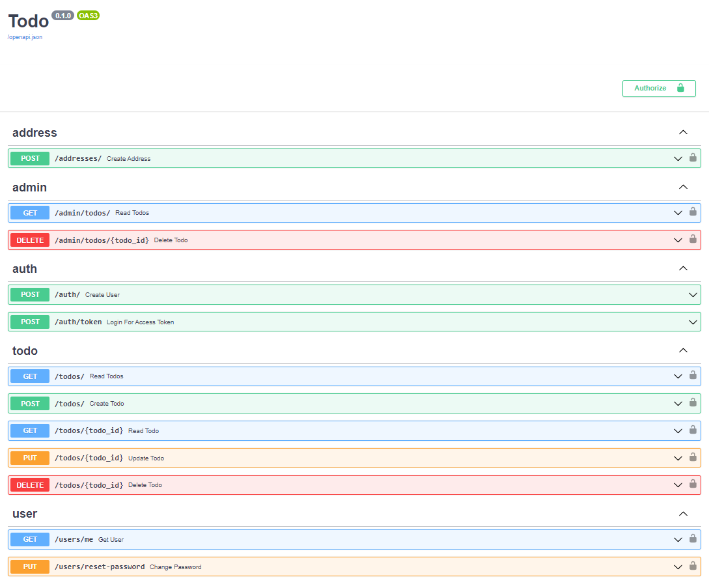

## Todo App.

### Description.

A simple Todo app with user authentication & authorization and many more features using FastAPI.

### Installation.

**NOTE:** Python3 must be already installed.

```shell
git clone https://github.com/Vasyl-Poremchuk/todo-app
cd social_media
python -m venv venv
venv\Scripts\activate (Windows) or sourse venv/bin/activate (Linux or macOS)
pip install -r requirements.txt
```

**NOTE:** Before running the application, you must create **.env** file and fill it using the template in the **.env.sample** file.

### Running the application on the local machine.

```shell
uvicorn src.main:app --reload
```

### Running the application via the docker container.

```shell
docker compose up -d
```

**NOTE:** The above command creates & runs containers in detached mode (running containers in the background).

### Swagger documentation.

The **Todo** add has several endpoints available, which you can check out in the swagger documentation (use the [LINK](http://127.0.0.1:8000/docs) to check it out if you are running locally).



### Heroku deployment.

Check it out: [LINK](https://fastapi-todo-app-126126b47426.herokuapp.com/docs).
